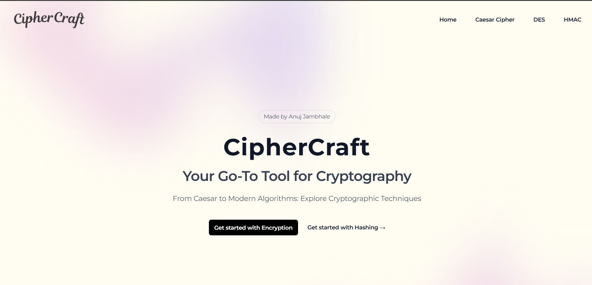

# CipherCraft Crypto Web Application



## Table of Contents

- [Overview](#Overview)
- [Features](#features)
- [Technologies Used](#technologies-used)
- [Installation](#installation)
- [Usage](#usage)
- [Contributing](#contributing)

## Overview

Crypto Web App is a web application built with React.js that provides users with tools for encryption and decryption using various algorithms, including Caesar cipher and DES cipher. Additionally, the app supports hashing methods such as HMAC and MD5, making it a versatile tool for secure data handling.

## Features

- **Encryption and Decryption**:
  - Supports Caesar cipher for simple text encryption.
  - Implements DES cipher for more secure encryption.
- **Hashing**:
  - Generate HMAC and MD5 hashes for data integrity and verification.
- **User -Friendly Interface**: Intuitive design for easy navigation and usage.
- **Real-Time Processing**: Instant feedback on encryption, decryption, and hashing operations.

## Technologies Used

- **Frontend**: React.js
- **Libraries**: [CryptoJS](https://github.com/brix/crypto-js) for encryption and hashing algorithms.

## Installation

To run the project locally, follow these steps:

1. Clone the repository:

   ```bash
   git clone https://github.com/jambhaleAnuj/crypto_webapp.git
   ```

2. Navigate to the project directory:

   ```bash
   cd crypto_webapp
   ```

3. Install the required dependencies:

   ```bash
   npm install
   ```

4. Start the development server:

   ```bash
   npm start
   ```

5. Open your browser and go to http://localhost:3000.

## Usage

1. Enter the text you want to encrypt or decrypt in the provided input field.
2. Select the desired algorithm (Caesar cipher, DES cipher, HMAC, or MD5).
3. Click the corresponding button to perform the operation.
4. View the results instantly on the screen.

## Contributing

Contributions are welcome! If you have suggestions for improvements or new features, please fork the repository and submit a pull request.

1. Fork the repository.
2. Create a new branch:

```bash
git checkout -b feature/YourFeature
```

3. Make your changes and commit them:

```bash
git commit -m "Add your message here"
```

4. Push to the branch:

```bash
git push origin feature/YourFeature
```

5. Open a pull request.
